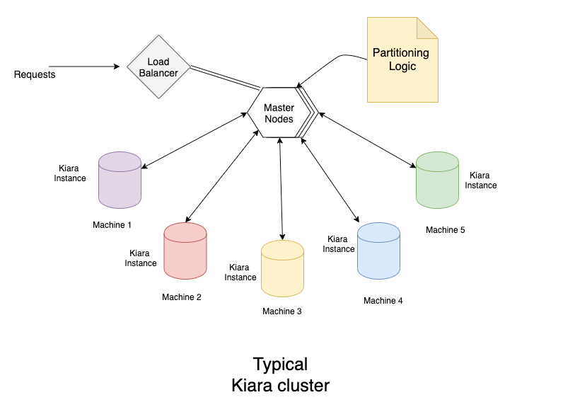
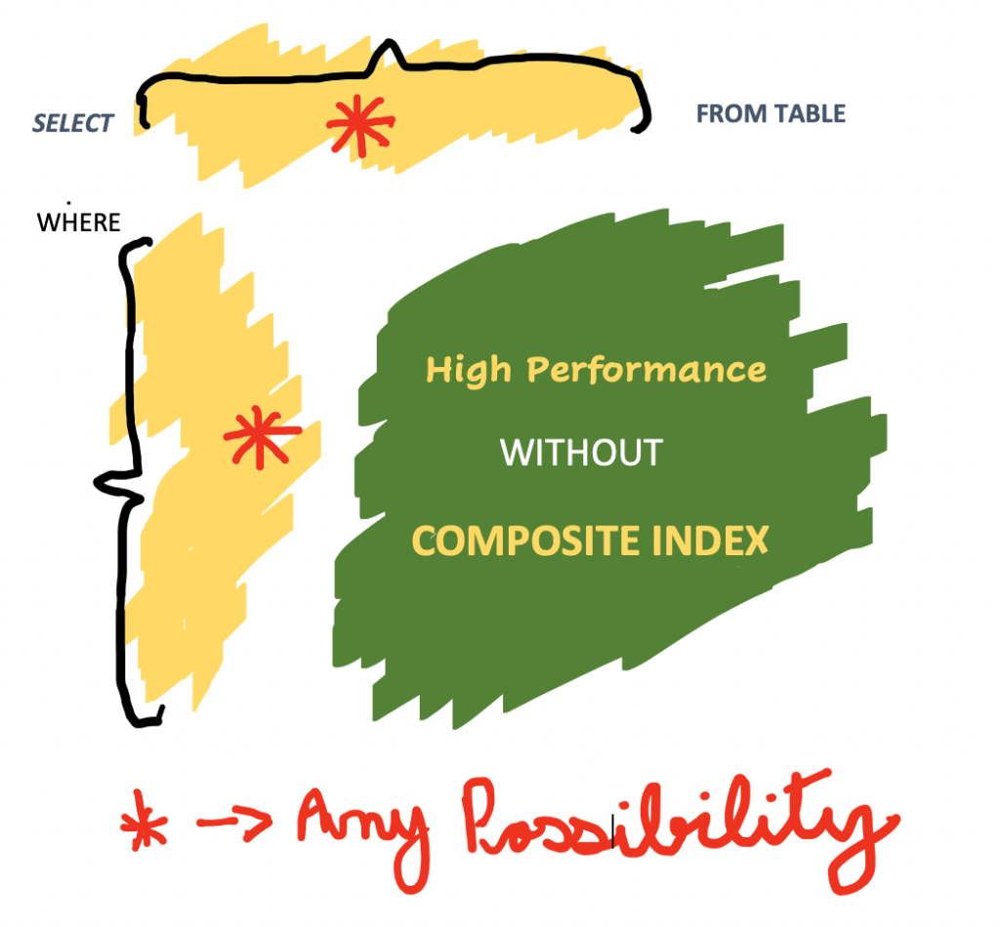
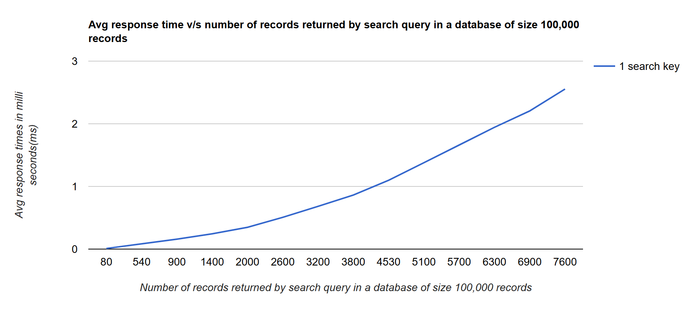
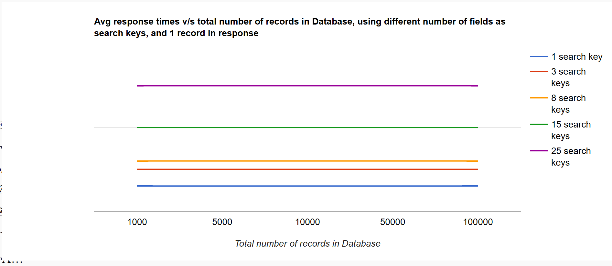

# Kiara DB

## Overview

Kiara DB is an in-memory, static NoSQL database designed for fast and flexible search over semi-static data. Its key idea is to support search by different combinations of attributes without requiring every composite index to be created in advance.

## Research Foundation

The project is connected to my research paper:

**Efficient Storage and Retrieval of In-Memory Static Data**  
Journal of Algorithms and Computation, Volume 52, Issue 1, Pages 83–96, June 2020  
DOI: 10.22059/jac.2020.76227

[Read the paper](https://jac.ut.ac.ir/article_76227_f4783d3e9e2ddaf29259318978af6743.pdf)

## Problem

Traditional hash-based and B-tree-based composite indexes are widely used for search and retrieval. However, when the user needs freedom to search by many possible key combinations, composite indexing can create memory and maintenance overhead.

## Solution

Kiara DB explores an algorithmic and data-structure-based approach for semi-static data where search flexibility is important and the data does not change frequently.

## Distinctive Capabilities

- In-memory static data storage
- NoSQL-style access pattern
- Search by combinations of data attributes
- Composite-key flexibility without pre-creating every composite index
- Memory de-duplication concepts
- Performance-oriented retrieval for suitable workloads

## My Contribution

I designed the algorithmic concept, wrote the research paper, and implemented the open-source project that demonstrates the approach.

## Links

- [Research paper](https://jac.ut.ac.ir/article_76227_f4783d3e9e2ddaf29259318978af6743.pdf)
- [Project website](https://www.kapoorlabs.com/kiara/)
- [GitHub repository](https://github.com/kapoorlabs/kiara)

## Portfolio Positioning

Kiara DB can be presented as an original technical contribution supported by:

- A published research paper
- Open-source implementation
- Algorithmic novelty
- Practical application in production-style use cases
- Public availability of the concept and implementation

## Architecture and Performance Visuals

### Cluster Architecture

### Product Positioning

### Performance Snapshots

## Quick Documentation

For practical onboarding and feature walkthroughs, see the [Kiara usage guide](./-kiara-usage).